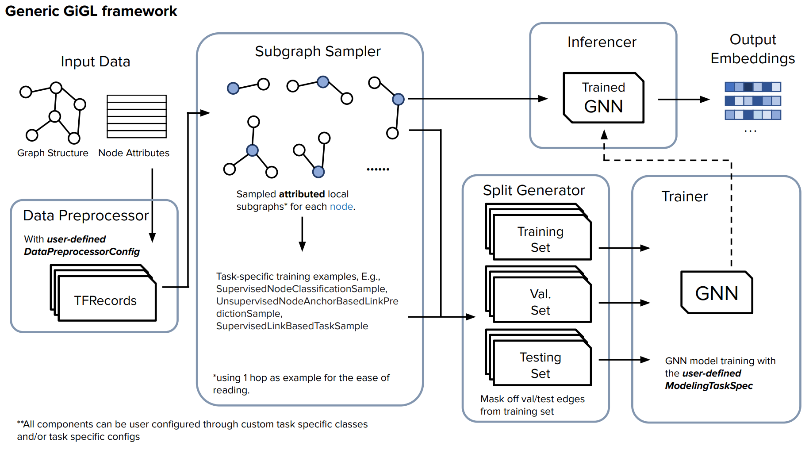

<!-- To align the logo with the text on the sphinx page -->

<div align="center">
  
  <h1 style="display: inline-block; vertical-align: middle; margin-left: 20px; font-size: 48px; line-height: 80px;">
    GiGL: Gigantic Graph Learning
  </h1>
</div>

GiGL is an open-source library for training and inference of Graph Neural Networks at very large (billion) scale.

See 📖 [Documentation](docs/) for more details

## Key Features 🌟

- 🧠 **Versatile GNN Applications**: Supports easy customization in using GNNs in supervised and unsupervised ML
  applications like node classification and link prediction.

- 🚀 **Designed for Scalability**: The architecture is built with horizontal scaling in mind, ensuring cost-effective
  performance throughout the process of data preprocessing and transformation, model training, and inference.

- 🎛️ **Easy Orchestration**: Simplified end-to-end orchestration, making it easy for developers to implement, scale, and
  manage their GNN projects.

______________________________________________________________________

## GiGL Components ⚡️

GiGL contains six components, each designed to facilitate the platforms end-to-end graph machine learning (ML) tasks.
The components are as follows:

| Component | Source Code | Documentation |
|-------------------|---------------------------------------------------------------------------------------------------------------------------|------------------------------------------------------------|
| Config Populator | [here](python/gigl/src/config_populator/config_populator.py) |
[here](docs/sphinx/source/components/config_populator.md) | | Data Preprocessor |
[here](python/gigl/src/data_preprocessor/data_preprocessor.py) |
[here](docs/sphinx/source/components/data_preprocessor.md) | | Subgraph Sampler |
[here](scala/subgraph_sampler/src/main/scala/Main.scala) | [here](docs/sphinx/source/components/subgraph_sampler.md) | |
Split Generator | [here](scala/split_generator/src/main/scala/Main.scala) |
[here](docs/sphinx/source/components/split_generator.md) | | Trainer | [here](python/gigl/src/training/trainer.py) |
[here](docs/sphinx/source/components/trainer.md) | | Inferencer | [here](python/gigl/src/inference/gnn_inferencer.py) |
[here](docs/sphinx/source/components/inferencer.md) |

The figure below illustrates at a high level how all the components work together for and end-to-end GiGL pipeline.



## Installation ⚙️

There are various ways to use GiGL. The recommended solution is to set up a conda environment and use some handy
commands:

From the root directory:

```bash
make initialize_environment
conda activate gnn
```

This creates a Python 3.9 environment with some basic utilities. Next, to install all user dependencies:

```bash
make install_deps
```

If you *instead* want a developer-install which includes some extra tooling useful for contributions:

```bash
make install_dev_deps
```

<details>
<summary>Local Repo Setup</summary>

For developing on GiGL see our [development guide](Development.md) and [contribution guidelines](Contributing.md)

</details>

<details>
<summary>Using Docker</summary>
todo
</details>

<br />

## Configuration 📄

Before getting started with running components in GiGL, it’s important to set up your config files. These are necessary
files required for each component to operate. The two required files are:

- **Resource Config**: Details the resource allocation and environmental settings across all GiGL components. This
  encompasses shared resources for all components, as well as component-specific settings.

- **Task Config**: Specifies task-related configurations, guiding the behavior of components according to the needs of
  your machine learning task.

To configure these files and customize your GiGL setup, follow our step-by-step guides:

- [Resource Config Guide](%22todo/%22)
- [Task Config Guide](%22todo/%22)

## Usage 🚀

GiGL offers 3 primiary methods of usage to run the components for your graph machine learning tasks.

### 1. Importable GiGL

To easily get started or incorporate GiGL into your existing workflows, you can simply `import gigl` and call the
`.run()` method on its components.

<details>
<summary>Example</summary>

```python
from gigl.src.training.trainer import Trainer

trainer = Trainer()
trainer.run(task_config_uri, resource_config_uri, job_name)
```

</details>

### 2. Command-Line Execution

Each GiGL component can be executed as a standalone module from the command line. This method is useful for batch
processing or when integrating into shell scripts.

<details>
<summary>Example</summary>

```
python -m \
    gigl.src.training.trainer \
    --job_name your_job_name \
    --task_config_uri gs://your_project_bucket/task_config.yaml \
    --resource_config_uri "gs://your_project_bucket/resource_conifg.yaml"
```

</details>

### 3. Kubeflow Pipeline Orchestration

GiGL also supports pipeline orchestration using Kubeflow. This allows you to easily kick off an end-to-end run with
little to no code. See [Kubeflow Orchestration](%22todo%22) for more information

\
The best way to get more familiar with GiGL is to go through the various [examples](%22todo%22) or for specific details
see our [user guide](%22todo%22).

## Tests 🔧

Testing in GiGL is designed to ensure reliability and robustness across different components of the library. We support
three types of tests: unit tests, local integration tests, and cloud integration end-to-end tests.

### Unit Tests

GiGL's unit tests focus on validating the functionality of individual components and high-level utilities. They also
check for proper formatting, typing, and linting standards.

<details>
<summary>More Details</summary>

- No external assets or a GCP project are required.
- Unit tests run on every commit on a pull request via Github Actions

To run unit tests locally, execute the following command:

```bash
# Runs both Scala and Python unit tests.
make unit_test

# Runs just Python unit tests
make unit_test_py

# Runs just Scala unit tests
make unit_test_scala
```

</details>

### Local Integration Test

GiGL's local integration tests simulate the pipeline behavior of GiGL components. These tests are crucial for verifying
that components function correctly in sequence and that outputs from one component are correctly handled by the next.

<details>
<summary>More Details</summary>

- Utilizes mocked/synthetic data publicly hosted in GCS (see: [Public Assets](%22todo%22))
- Require access and run on cloud services such as BigQuery, Dataflow etc.
- Required to pass before merging PR (Pre-merge check)

To run integration tests locally, you need to provide yur own resource config and run the following command:

```bash
make integration_test resource_config_uri="gs://your-project-bucket/resource_config.yaml"
```

</details>

### Cloud Integration Test (End-to-End)

Cloud integration tests run a full end-to-end GiGL pipeline within GCP, also leveraging cloud services such as Dataflow,
Dataproc, and Vertex AI.

<details>
<summary>More Details</summary>

- Utilizes mocked/synthetic data publicly hosted in GCS (see: [Public Assets](%22todo%22))
- Require access and run on cloud services such as BigQuery, Dataflow etc.
- Required to pass before merging PR (Pre-merge check). Access to the orchestration, logs, etc., is restricted to
  authorized internal engineers to maintain security. Failures will be reported back to contributor as needed.

To test cloud integration test functionality, you can replicate by running and end-to-end pipeline by following along
one of our Cora examples (See: [Examples](%22todo%22))

</details>
<br>

## Contribution 🔥

Your contributions are always welcome and appreciated. The following are the things you can do to contribute to this
project.

1. **Report a bug** <br> If you think you have encountered a bug please feel free to report it
   [here](%22todo_point_to_issues%22) and someone from the team will take a look.

1. **Request a feature** <br> Feature requests are always welcome! You can request a feature by adding it
   [here](%22todo_point_to_feature_req%22)

1. **Create a pull request** <br> Pull request are always greatly appreciated. You can get started by picking up any
   open issues from [here](%22todo_point_to_issues%22) and making a pull request.

> If you are new to open-source, make sure to check read more about it
> [here](https://www.digitalocean.com/community/tutorial_series/an-introduction-to-open-source) and learn more about
> creating a pull request
> [here](https://www.digitalocean.com/community/tutorials/how-to-create-a-pull-request-on-github).

For more information, see our [Contributing Guide](%22todo%22)

## Additional Resources ❗

You may still have unanswered questions or may be facing issues. If so please see our [FAQ](%22todo%22) or our
[User Guide](%22todo%22) for further guidance.

## Citation

If you use GiGL in publications, we would appreciate citations to [our paper](https://arxiv.org/pdf/2502.15054):

```bibtex
@article{zhao2025gigl,
  title={GiGL: Large-Scale Graph Neural Networks at Snapchat},
  author={Zhao, Tong and Liu, Yozen and Kolodner, Matthew and Montemayor, Kyle and Ghazizadeh, Elham and Batra, Ankit and Fan, Zihao and Gao, Xiaobin and Guo, Xuan and Ren, Jiwen and Park, Serim and Yu, Peicheng and Yu, Jun and Vij, Shubham and Shah, Neil},
  journal={arXiv preprint arXiv:2502.15054},
  year={2025}
}
```

## License 🔒

[MIT License](LICENSE)
