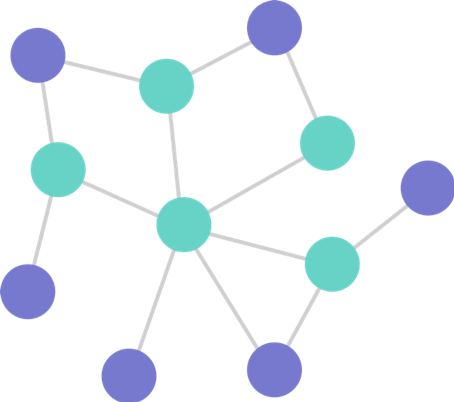

# GiGL Components

## Config Populator

Component for processing template config files and updating with fields that are needed for downstream components.
[More Details](../components/config_populator)

---

## Data Preprocessor

Component for reading and processing node, edge, and feature data and transforming it as needed for downstream components.
[More Details](../components/data_preprocessor)

---

## Subgraph Sampler

Component that generates k-hop localized subgraphs for each node in the graph.
[More Details](../components/subgraph_sampler)

---
## Split Generator

Component to split the data into training, validation, and test sets.
[More Details](../components/split_generator)

---

## Trainer

Component to run distributed training either locally or on the cloud.
[More Details](../components/trainer)

---

## Inferencer

Component that runs inference to generate output embeddings and/or predictions
[More Details](../components/inferencer)
